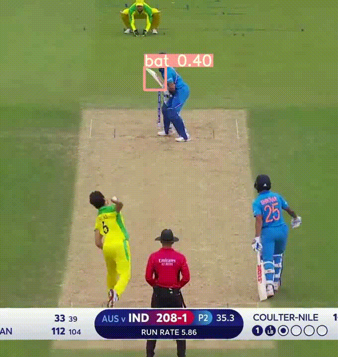

# Cricket Bat Ball Tracking Challenge

## Introduction

This competition aims to effectively track the bat and ball at every frame 
  

## Working

I have used yolov5s model and trained it for 10 epochs. You can try for biggest models like yolov5x and train it longer for better results. Also make sure to keep the yolo image formst
in mind before training

## Example Output

